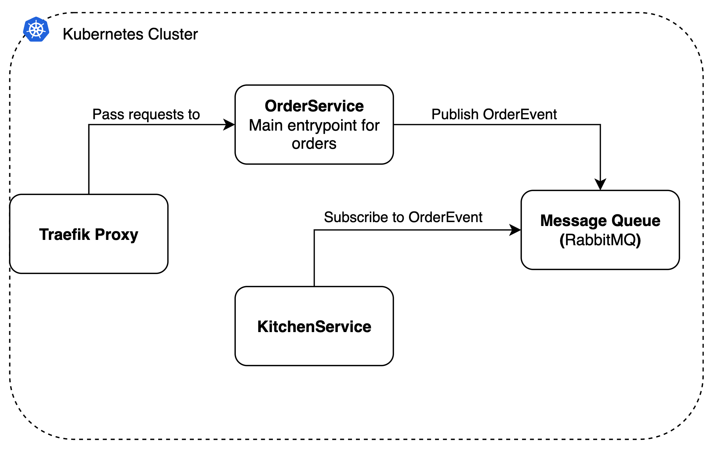

[](https://sonarcloud.io/summary/new_code?id=prodtest-demo)

[](https://sonarcloud.io/summary/new_code?id=prodtest-demo)

[](https://sonarcloud.io/summary/new_code?id=prodtest-demo) [](https://sonarcloud.io/summary/new_code?id=prodtest-demo) [](https://sonarcloud.io/summary/new_code?id=prodtest-demo) [](https://sonarcloud.io/summary/new_code?id=prodtest-demo) [](https://sonarcloud.io/summary/new_code?id=prodtest-demo)


# Prodtest demo

This is the readme for the prodtest demo project. For more information, check the [docs](https://brdv.github.io/prodtest-docs).

The current project architecture is as follows:



## Contents

The contents of this Readme are:

- [Prerequisites](#prerequisites)
- [Setup](#setup)
- [Checking the demo project](#checking-the-demo-project)
- [Other commands](#useful-scripts)

## Prerequisites

In order to run the project, please make sure the following tools are installed:

- [Docker](https://docs.docker.com/get-docker/)
- [Kubectl](https://kubernetes.io/docs/tasks/tools/)
- [Helm](https://helm.sh/docs/intro/install/)

\* **Note:** Please use [WSL](https://learn.microsoft.com/en-us/windows/wsl/install) if you are on windows

To check if everyting is installed correctly, run the following commands:

```bash
# for docker
docker --version
# for kubectl
kubectl version --short
# for helm
helm version --short
```

If it outputs a version number, the installation has succeeded.

## Setup kubernetes cluster

Follow the guide below to setup and start the project.

1.  Once all prerquisites are installed, make sure you have a docker kubernetes cluster running following [this guide](https://docs.docker.com/desktop/kubernetes/#enable-kubernetes).

2.  Next make sure the docker-desktop kubernetes context is selected for kubectl:

    ```bash
    # 1) get all contexts
    kubectl config get-contexts

    # 2) set docker-desktop context if not set allready *
    kubectl config set-context docker-desktop
    ```

    \* you can see if docker-desktop is selecten in the output of command 1.

3.  Build all docker images (locally)

    Run the build scripts

    ```bash
    # from the projects root folder:
    sh ./scripts/docker/latest.build.sh
    sh ./scripts/docker/next.build.sh
    ```

4.  Apply infrastructure resources:

    Run setup-infra script

    ```bash
    # from the projects root folder:
    sh ./scripts/kubernetes/setup-infra.sh
    ```

    **NOTE**: Because it takes some time for the infrastructure to be completed; the script waits 30 secs.

5.  Apply other kubernetes resourcess

    ```bash
    # from the projects root folder:
    sh ./scripts/kubernetes/setup-darklaunch.sh
    ```

    This will apply all resources to the cluster. You will see all resources in the console. (Run `kubectl get all` if they do not show up.)

Nice job, you've successfully set up all resources for this demo project. You can now proceed to the next section, checks.

## Checking the demo project.

1. First of all you can check if the API is up and running by going to "http://localhost/api/health". You should then see a JSON object as follows:

   ```json
   {
     "health": "ok"
   }
   ```

2. To see the Traefik (proxy) dashboard, run the following command:

   ```bash
   kubectl port-forward $(kubectl get pods --selector "app.kubernetes.io/name=traefik" --output=name) 9000:9000
   ```

   Leave the shell open and go to http://localhost:9000/dashboard/

3. You can check the Prometheus metrics by running the following command:

   ```bash
   kubectl port-forward $(kubectl get pods --selector "app.kubernetes.io/name=traefik" --output=name) 9000:9100
   ```

   Leave the shell open and go to http://localhost:9000/metrics/

4. Next you can call the API a couple of times by using the simulate script:

   ```bash
   sh ./scripts/simulate_api_calls.sh -n 10
   ```

   \* the `-n 10` specifies the number of times to call the API (in this case, 10 times)

   After running the script, you can check the responses of the API in `temp/request_output.json`. Thereby you can check the metrics endpoint in step `3`, however, currently this is a bit cryptic.

5. Check the logs of the kitchen service by running the following script:

   ```bash
   sh ./scripts/kubernetes/get-kitchen-logs.sh
   ```

## Useful scripts

There are a few other commands that can be helpfull during testing or development.

1. Cleanup kubernetes and helm charts

   If for any reason you want to clean up the configured kubernetes resources you can enter the following command in the terminal:

   ```bash
   sh ./scripts/kubernetes/cleanup.sh
   ```

2. Simulate API requests

   In order to simulate API requests, you can use the script `simulate_api_calls.sh`. This script will by default call the api 500 times and save the responses to `temp/request_output.json`.
   Use the script as follows:

   ```bash
   sh ./scripts/simulate_api_calls.sh
   ```

   \* _In case of an error like 'jq command does not exist' [install jq](https://stedolan.github.io/jq/download/)_

3. Check KitchenService logs

   Make sure you posted at least one order or ran the simulation script.

   ```bash
   sh ./scripts/kubernetes/get-kitchen-logs.sh
   ```

   If the setup went right, you should see a HandledOrder object with the same OrderId on both services. The Id is different and the handler as well (to demonstrate the dark launch).

4. Check RabbitMQ dashboard

   You can access the RabbitMQ dashboard by port forewarding its instance.

   ```bash
   sh ./scripts/pfw-rabbitmq.sh
   ```

   Now open the browser at http://localhost:15672 and log in with the credentials in your console.

sh ./scripts/docker/build-prodtest-images latest;sh ./scripts/docker/build-prodtest-images vnext; sh ./scripts/kubernetes/setup-infra.sh;sh ./scripts/kubernetes/setup-darklaunch.sh
